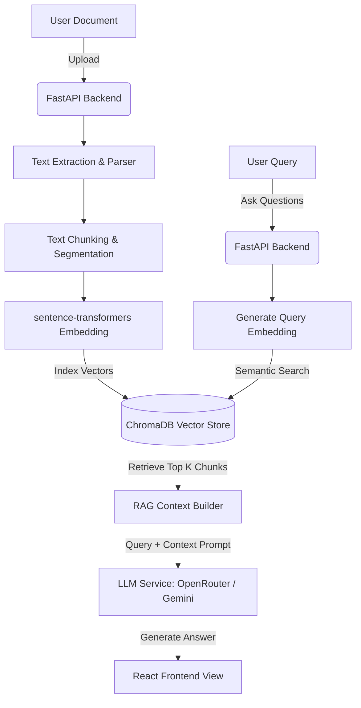

# Ask Your Documents - AI-Powered Document Q&A System

An AI-powered Document Question Answering System that enables users to upload documents (PDF, TXT, DOCX) and interact with their contents using natural language. 

The application utilizes a Retrieval-Augmented Generation (RAG) pipeline to parse text, segment it into manageable chunks, generate vector embeddings, store them in a local vector database, and perform semantic similarity searches to generate accurate, context-aware answers.

---

## Features & RAG Ingestion Pipeline

- **Multi-Document Parsing**: Automatically extracts text from uploaded PDF, TXT, or DOCX files.
- **RAG Pipeline Ingestion Modal**: Centered popup stepper that visualizes the ingestion pipeline steps:
  1. **Chunking**: Segmenting text into overlapping chunks.
  2. **Embedding**: Converting text chunks into high-dimensional vector embeddings using a local HuggingFace model.
  3. **Vector DB**: Storing and indexing inside a persistent local ChromaDB instance.
- **Natural Language Q&A**: Asks questions using a spacious viewport-constrained ChatGPT-style chat interface with automatic scroll-to-bottom.
- **Sidebar Pagination**: Paginated list displaying up to 5 uploaded documents to keep the interface tidy.

---

## Tech Stack

### Backend
- **FastAPI**: Modern, high-performance async Python web framework.
- **pdfplumber**: Reliable PDF text parsing and extraction.
- **python-docx**: DOCX file parser.
- **sentence-transformers (`all-MiniLM-L6-v2`)**: Local vector embedding generation (cached locally).
- **ChromaDB**: Highly efficient local vector database.
- **OpenRouter & Google Gemini**: LLM providers for response generation.

### Frontend
- **React 18 with Vite**: Modern, ultra-fast UI rendering framework.
- **Tailwind CSS**: Sleek, responsive styling with a custom light-purple theme.
- **Axios**: API communication with the FastAPI backend.
- **Lucide React**: Premium icon assets.

---

## Core System Architecture



---

## Setup & Running Instructions

### Prerequisites
- Python 3.9+
- Node.js 16+
- OpenRouter API Key (placed in backend configuration)

### Option 1: Automated Installation (Recommended)

Run the root setup script to automatically configure backend virtual environments, install Python dependencies, install frontend Node modules, and set up config templates:

```bash
chmod +x setup.sh
./setup.sh
```

### Option 2: Manual Installation

#### 1. Backend Setup
Navigate to the `backend` folder, set up a virtual environment, install dependencies, and create a `.env` configuration file:

```bash
cd backend
python3 -m venv venv
source venv/bin/activate  # On Windows: venv\Scripts\activate
pip install -r requirements.txt
```

Create a `.env` file inside the `backend/` directory:
```env
LLM_PROVIDER=openrouter
OPENROUTER_API_KEY=your_openrouter_api_key_here
```

Start the FastAPI application. *Note: We set `HF_HUB_OFFLINE=1` to run the embedding generator with local cached weights:*
```bash
HF_HUB_OFFLINE=1 uvicorn main:app --reload --host 0.0.0.0 --port 8000
```
- API Docs: http://localhost:8000/docs

#### 2. Frontend Setup
Open a separate terminal window, navigate to the `frontend` folder, install Node dependencies, and start the development server:

```bash
cd frontend
npm install
npm run dev
```
- Web Application: http://localhost:5173

---

## Usage Guide

1. Open http://localhost:5173 in your browser.
2. Drag and drop any PDF, TXT, or DOCX document into the dotted upload zone (or click to browse).
3. Watch the **Processing RAG Pipeline** overlay modal step through **Chunking**, **Embedding**, and **Vector DB** storage.
4. Type a natural language question in the query input at the bottom of the screen.
5. The chat panel will automatically scroll to the bottom as the answer is generated.

---

## Verification & Testing

To run the automated Python backend tests verifying document extraction, semantic similarity search, and RAG functionality:

```bash
cd backend
source venv/bin/activate
python test_backend.py
```

---

## Troubleshooting

- **Error code: 402 (Payment Required)**: OpenRouter requires sufficient credits to cover the maximum token limit. The application is pre-configured with a small token cap (`max_tokens=150`) to keep requests lightweight and inexpensive.
- **ChromaDB Lock / SQLite Errors**: If backend tests hang, make sure you stop the running FastAPI backend server instance first. ChromaDB utilizes a local persistent SQLite file lock which prevents simultaneous write accesses.